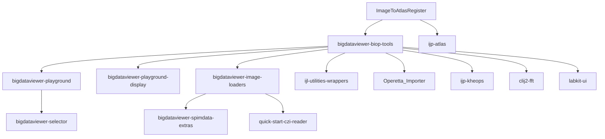

# Repository Dependencies

## Version Badges

## Dependency Graph

```mermaid
graph TD
    BDV_PG[bigdataviewer-playground]
    BDV_SEL[bigdataviewer-selector]
    BDV_TOOLS[bigdataviewer-biop-tools]
    BDV_DISP[bigdataviewer-playground-display]
    BDV_LOADERS[bigdataviewer-image-loaders]
    BDV_SPIM[bigdataviewer-spimdata-extras]
    IJL_UTIL[ijl-utilities-wrappers]
    OP_IMP[Operetta_Importer]
    KHEOPS[ijp-kheops]
    CZI[quick-start-czi-reader]
    ATLAS_REG[ImageToAtlasRegister]
    ATLAS[ijp-atlas]
    CLIJ[clij2-fft]
    LABKIT[labkit-ui]
    
    BDV_PG --> BDV_SEL
    
    BDV_TOOLS --> BDV_PG
    BDV_TOOLS --> BDV_DISP
    BDV_TOOLS --> BDV_LOADERS
    BDV_TOOLS --> IJL_UTIL
    BDV_TOOLS --> OP_IMP
    BDV_TOOLS --> KHEOPS
    BDV_TOOLS --> CLIJ
    BDV_TOOLS --> LABKIT
    
    BDV_LOADERS --> BDV_SPIM
    BDV_LOADERS --> CZI
    
    ATLAS_REG --> BDV_TOOLS
    ATLAS_REG --> ATLAS
    
    click BDV_PG "https://maven.scijava.org/#browse/browse:releases:sc%2Ffiji%2Fbigdataviewer-playground"
    click BDV_SEL "https://maven.scijava.org/#browse/browse:releases:ch%2Fepfl%2Fbiop%2Fbigdataviewer-selector"
    click BDV_TOOLS "https://maven.scijava.org/#browse/browse:releases:ch%2Fepfl%2Fbiop%2Fbigdataviewer-biop-tools"
    click BDV_DISP "https://maven.scijava.org/#browse/browse:releases:sc%2Ffiji%2Fbigdataviewer%2Fbigdataviewer-playground-display"
    click BDV_LOADERS "https://maven.scijava.org/#browse/browse:releases:ch%2Fepfl%2Fbiop%2Fbigdataviewer-image-loaders"
    click BDV_SPIM "https://maven.scijava.org/#browse/browse:releases:ch%2Fepfl%2Fbiop%2Fbigdataviewer-spimdata-extras"
    click IJL_UTIL "https://maven.scijava.org/#browse/browse:releases:ch%2Fepfl%2Fbiop%2Fijl-utilities-wrappers"
    click OP_IMP "https://maven.scijava.org/#browse/browse:releases:ch%2Fepfl%2Fbiop%2FOperetta_Importer"
    click KHEOPS "https://maven.scijava.org/#browse/browse:releases:ch%2Fepfl%2Fbiop%2Fijp-kheops"
    click CZI "https://maven.scijava.org/#browse/browse:releases:ch%2Fepfl%2Fbiop%2Fquick-start-czi-reader"
    click ATLAS_REG "https://maven.scijava.org/#browse/browse:releases:ch%2Fepfl%2Fbiop%2FImageToAtlasRegister"
    click ATLAS "https://maven.scijava.org/#browse/browse:releases:ch%2Fepfl%2Fbiop%2Fatlas"
```
